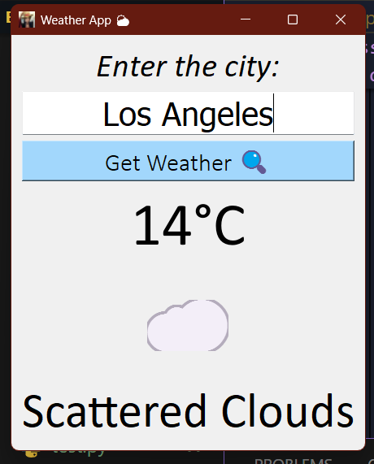

# Weather App ⛅

A beautiful and user-friendly desktop weather application built with Python and PyQt5. Get real-time weather information for any city in the world with an intuitive graphical interface.

## Features ✨

- 🌍 Search weather for any city worldwide
- 🌡️ Real-time temperature in Celsius
- 🎨 Beautiful and intuitive user interface
- 😊 Weather-appropriate emoji indicators
- 📝 Detailed weather descriptions
- ⚡ Fast and responsive
- 🔐 Secure API key management
- ⌨️ Press Enter to search quickly

## Screenshots 📸



## Requirements 📋

- Python 3.7 or higher
- PyQt5
- requests library
- OpenWeatherMap API key (free)

## Installation 🚀

### 1. Clone the repository
```bash
git clone https://github.com/yourusername/weather-app.git
cd weather-app
```

### 2. Install required packages
```bash
pip install -r requirements.txt
```

### 3. Get your API key
1. Visit [OpenWeatherMap](https://openweathermap.org/api)
2. Sign up for a free account
3. Go to [API Keys](https://home.openweathermap.org/api_keys)
4. Generate a new API key

### 4. Run the application
```bash
python weather_app.py
```

## Usage 💡

1. Launch the application
2. Enter a city name in the text field
3. Click "Get Weather 🔍" or press Enter
4. View the current weather information

## Project Structure 📁

```
weather-app/
│
├── weather_app.py      # Main application file
├── config.py           # API key configuration (create this)
├── requirements.txt    # Python dependencies
├── .gitignore         # Git ignore file
├── README.md          # Project documentation
└── screenshot.png     # App screenshot (optional)
```

## API Information 🔑

This app uses the [OpenWeatherMap API](https://openweathermap.org/api) to fetch weather data.

*Free tier limits:*
- 60 calls per minute
- 1,000,000 calls per month

## Error Handling 🛡️

The app handles various error scenarios:
- Invalid city names
- Network connection issues
- API rate limits
- Invalid API keys
- Server errors

## Technologies Used 🛠️

- *Python* - Programming language
- *PyQt5* - GUI framework
- *Requests* - HTTP library for API calls
- *OpenWeatherMap API* - Weather data provider

## Contributing 🤝

Contributions are welcome! Here's how you can help:

1. Fork the repository
2. Create a new branch (`git checkout -b feature/improvement`)
3. Make your changes
4. Commit your changes (`git commit -am 'Add new feature'`)
5. Push to the branch (`git push origin feature/improvement`)
6. Create a Pull Request

## License 📄

This project is licensed under the MIT License - see the [LICENSE](LICENSE) file for details.

## Acknowledgments 🙏

- [OpenWeatherMap](https://openweathermap.org/) for providing the weather API
- [PyQt5](https://www.riverbankcomputing.com/software/pyqt/) for the GUI framework
- Weather emojis from Unicode standard

## Author ✍️

Jay Dholakia
- GitHub: [@jay789-code-pixel](https://github.com/jay789-code-pixel)
- Email: jaydholakia2007@gmail.com

## Support 💬

If you encounter any issues or have questions:
- Open an issue on GitHub
- Contact me via email

---

⭐ If you found this project helpful, please give it a star!

**Note:** Remember to keep your API key secure and never share it publicly!